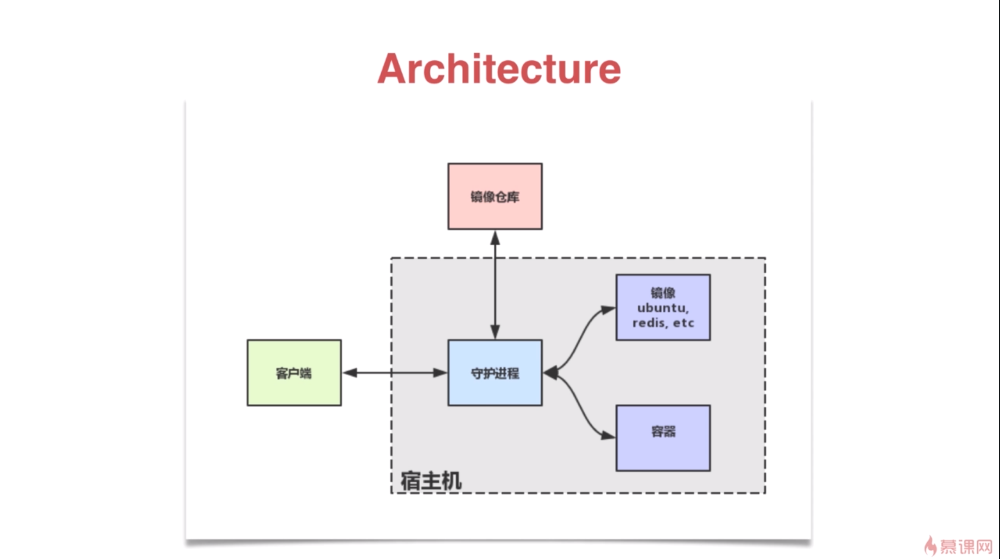

## docker是什么

 docker比如成轻量型的小型虚拟机


## docker构架介绍与实战

```
docker build
docker pull
docker run 
```




# Docker Hello World

Docker 允许你在容器内运行应用程序， 使用 **docker run** 命令来在容器内运行一个应用程序。

输出Hello world

```
docker run ubuntu:15.10 /bin/echo "Hello world"
```


各个参数解析：

- **docker:** Docker 的二进制执行文件。
- **run:** 与前面的 docker 组合来运行一个容器。
- **ubuntu:15.10** 指定要运行的镜像，Docker 首先从本地主机上查找镜像是否存在，如果不存在，Docker 就会从镜像仓库 Docker Hub 下载公共镜像。
- **/bin/echo "Hello world":** 在启动的容器里执行的命令

以上命令完整的意思可以解释为：Docker 以 ubuntu15.10 镜像创建一个新容器，然后在容器里执行 bin/echo "Hello world"，然后输出结果。

------


# Docker 镜像使用

当运行容器时，使用的镜像如果在本地中不存在，docker 就会自动从 docker 镜像仓库中下载，默认是从 Docker Hub 公共镜像源下载。

下面我们来学习：

- 1、管理和使用本地 Docker 主机镜像
- 2、创建镜像

------

## 列出镜像列表

我们可以使用 **docker images** 来列出本地主机上的镜像。

```
runoob@runoob:~$ docker images           
REPOSITORY          TAG                 IMAGE ID            CREATED             SIZE
ubuntu              14.04               90d5884b1ee0        5 days ago          188 MB
php                 5.6                 f40e9e0f10c8        9 days ago          444.8 MB
nginx               latest              6f8d099c3adc        12 days ago         182.7 MB
mysql               5.6                 f2e8d6c772c0        3 weeks ago         324.6 MB
httpd               latest              02ef73cf1bc0        3 weeks ago         194.4 MB
ubuntu              15.10               4e3b13c8a266        4 weeks ago         136.3 MB
hello-world         latest              690ed74de00f        6 months ago        960 B
training/webapp     latest              6fae60ef3446        11 months ago       348.8 MB
```

各个选项说明:

- **REPOSITORY：**表示镜像的仓库源
- **TAG：**镜像的标签
- **IMAGE ID：**镜像ID
- **CREATED：**镜像创建时间
- **SIZE：**镜像大小

同一仓库源可以有多个 TAG，代表这个仓库源的不同个版本，如 ubuntu 仓库源里，有 15.10、14.04 等多个不同的版本，我们使用 REPOSITORY:TAG 来定义不同的镜像。

所以，我们如果要使用版本为15.10的ubuntu系统镜像来运行容器时，命令如下：

## 进入容器里面

```
 docker run -t -i ubuntu:15.10 /bin/bash 
root@d77ccb2e5cca:/#
```

参数说明：

- **-i**: 交互式操作。
- **-t**: 终端。
- **ubuntu:15.10**: 这是指用 ubuntu 15.10 版本镜像为基础来启动容器。
- **/bin/bash**：放在镜像名后的是命令，这里我们希望有个交互式 Shell，因此用的是 /bin/bash。

如果要使用版本为 14.04 的 ubuntu 系统镜像来运行容器时，命令如下：

```
docker run -t -i ubuntu:14.04 /bin/bash 
root@39e968165990:/# 
```

如果你不指定一个镜像的版本标签，例如你只使用 ubuntu，docker 将默认使用 ubuntu:latest 镜像。

------


## 查找镜像search

我们可以从 Docker Hub 网站来搜索镜像，Docker Hub 网址为： **https://hub.docker.com/**

我们也可以使用 docker search 命令来搜索镜像。比如我们需要一个 httpd 的镜像来作为我们的 web 服务。我们可以通过 docker search 命令搜索 httpd 来寻找适合我们的镜像。

```
runoob@runoob:~$  docker search httpd
```

点击图片查看大图：

[](https://www.runoob.com/wp-content/uploads/2016/05/423F2A2C-287A-4B03-855E-6A78E125B346.jpg)

**NAME:** 镜像仓库源的名称

**DESCRIPTION:** 镜像的描述

**OFFICIAL:** 是否 docker 官方发布

**stars:** 类似 Github 里面的 star，表示点赞、喜欢的意思。

**AUTOMATED:** 自动构建。

------


### pull获取镜像

如果我们本地没有 ubuntu 镜像，我们可以使用 docker pull 命令来载入 ubuntu 镜像：

```
$ docker pull ubuntu
```

### bin/bash命令启动容器 进入容器中

以下命令使用 ubuntu 镜像启动一个容器，参数为以命令行模式进入该容器：

```
$ docker run -it ubuntu /bin/bash
```


参数说明：

- **-i**: 交互式操作。
- **-t**: 终端。
- **ubuntu**: ubuntu 镜像。
- **/bin/bash**：放在镜像名后的是命令，这里我们希望有个交互式 Shell，因此用的是 /bin/bash。

要退出终端，直接输入 **exit**:

```
root@ed09e4490c57:/# exit
```


## 删除镜像

镜像删除使用 **docker rmi** 命令，比如我们删除 hello-world 镜像：

```
$ docker rmi  ubuntu
```


------

## 创建镜像

当我们从 docker 镜像仓库中下载的镜像不能满足我们的需求时，我们可以通过以下两种方式对镜像进行更改。

- 1、从已经创建的容器中更新镜像，并且提交这个镜像
- 2、使用 Dockerfile 指令来创建一个新的镜像

### 更新镜像

更新镜像之前，我们需要使用镜像来创建一个容器。

```
runoob@runoob:~$ docker run -t -i ubuntu:15.10 /bin/bash
root@e218edb10161:/# 
```

在运行的容器内使用 **apt-get update** 命令进行更新。

在完成操作之后，输入 exit 命令来退出这个容器。

此时 ID 为 e218edb10161 的容器，是按我们的需求更改的容器。我们可以通过命令 docker commit 来提交容器副本。

```
runoob@runoob:~$ docker commit -m="has update" -a="runoob" e218edb10161 runoob/ubuntu:v2
sha256:70bf1840fd7c0d2d8ef0a42a817eb29f854c1af8f7c59fc03ac7bdee9545aff8
```

各个参数说明：

- **-m:** 提交的描述信息
- **-a:** 指定镜像作者
- **e218edb10161：**容器 ID
- **runoob/ubuntu:v2:** 指定要创建的目标镜像名

我们可以使用 **docker images** 命令来查看我们的新镜像 **runoob/ubuntu:v2**：

```
runoob@runoob:~$ docker images
REPOSITORY          TAG                 IMAGE ID            CREATED             SIZE
runoob/ubuntu       v2                  70bf1840fd7c        15 seconds ago      158.5 MB
ubuntu              14.04               90d5884b1ee0        5 days ago          188 MB
php                 5.6                 f40e9e0f10c8        9 days ago          444.8 MB
nginx               latest              6f8d099c3adc        12 days ago         182.7 MB
mysql               5.6                 f2e8d6c772c0        3 weeks ago         324.6 MB
httpd               latest              02ef73cf1bc0        3 weeks ago         194.4 MB
ubuntu              15.10               4e3b13c8a266        4 weeks ago         136.3 MB
hello-world         latest              690ed74de00f        6 months ago        960 B
training/webapp     latest              6fae60ef3446        12 months ago       348.8 MB
```

使用我们的新镜像 **runoob/ubuntu** 来启动一个容器

```
runoob@runoob:~$ docker run -t -i runoob/ubuntu:v2 /bin/bash                            
root@1a9fbdeb5da3:/#
```

### 构建镜像build

我们使用命令 **docker build** ， 从零开始来创建一个新的镜像。为此，我们需要创建一个 Dockerfile 文件，其中包含一组指令来告诉 Docker 如何构建我们的镜像。

```
runoob@runoob:~$ cat Dockerfile 
FROM    centos:6.7
MAINTAINER      Fisher "fisher@sudops.com"

RUN     /bin/echo 'root:123456' |chpasswd
RUN     useradd runoob
RUN     /bin/echo 'runoob:123456' |chpasswd
RUN     /bin/echo -e "LANG=\"en_US.UTF-8\"" >/etc/default/local
EXPOSE  22
EXPOSE  80
CMD     /usr/sbin/sshd -D
```

每一个指令都会在镜像上创建一个新的层，每一个指令的前缀都必须是大写的。

第一条FROM，指定使用哪个镜像源

RUN 指令告诉docker 在镜像内执行命令，安装了什么。。。

然后，我们使用 Dockerfile 文件，通过 docker build 命令来构建一个镜像。

```
docker build -t  centos:6.7 .
```

参数说明：

- **-t** ：指定要创建的目标镜像名
- **.** ：Dockerfile 文件所在目录，可以指定Dockerfile 的绝对路径
- centos:6.7   centos镜像名称   6.7 tag标签

使用docker images 查看创建的镜像已经在列表中存在,镜像ID为860c279d2fec

```
runoob@runoob:~$ docker images 
REPOSITORY          TAG                 IMAGE ID            CREATED              SIZE
centos              6.7                 860c279d2fec        About a minute ago   190.6 MB

```

### 设置镜像标签

我们可以使用 docker tag 命令，为镜像添加一个新的标签。

```
docker tag 860c279d2fec centos:dev
```

docker tag 镜像ID，这里是 860c279d2fec ,用户名称、镜像源名(repository name)和新的标签名(tag)。

使用 docker images 命令可以看到，ID为860c279d2fec的镜像多一个标签。

```
runoob@runoob:~$ docker images
REPOSITORY          TAG                 IMAGE ID            CREATED             SIZE
centos              6.7                 860c279d2fec        5 hours ago         190.6 MB
centos              dev                 860c279d2fec        5 hours ago         190.6 MB

```


# Docker Dockerfile

### 什么是 Dockerfile？

Dockerfile 是一个用来构建镜像的文本文件，文本内容包含了一条条构建镜像所需的指令和说明。

### 使用 Dockerfile 定制镜像

这里仅讲解如何运行 Dockerfile 文件来定制一个镜像，具体 Dockerfile 文件内指令详解，将在下一节中介绍，这里你只要知道构建的流程即可。

**1、下面以定制一个 nginx 镜像（构建好的镜像内会有一个 /usr/share/nginx/html/index.html 文件）**

在一个空目录下，新建一个名为 Dockerfile 文件，并在文件内添加以下内容：

```
# 设置基础镜像
FROM nginx
# 定义作者
MAINTAINER yao guan shou
# 将dist文件中的内容复制到 /usr/share/nginx/html/ 这个目录下面
COPY dist/  /usr/share/nginx/html/
# COPY nginx.conf /etc/nginx/nginx.conf
# COPY nginx.conf /etc/nginx/conf/nginx.conf
# 覆盖默认配置
COPY nginx.conf /etc/nginx/conf.d/default.conf
RUN echo '这是一个本地构建的docker nginx镜像'
 
```


**2、FROM 和 RUN 指令的作用**

**FROM**：定制的镜像都是基于 FROM 的镜像，这里的 nginx 就是定制需要的基础镜像。后续的操作都是基于 nginx。

**RUN**：用于执行后面跟着的命令行命令。有以下俩种格式：

shell 格式：

```
RUN <命令行命令>
# <命令行命令> 等同于，在终端操作的 shell 命令。
```

exec 格式：

```
RUN ["可执行文件", "参数1", "参数2"]
# 例如：
# RUN ["./test.php", "dev", "offline"] 等价于 RUN ./test.php dev offline
```

**注意**：Dockerfile 的指令每执行一次都会在 docker 上新建一层。所以过多无意义的层，会造成镜像膨胀过大。例如：

FROM centos
RUN **yum install** **wget**
RUN **wget** -O redis.tar.gz "http://download.redis.io/releases/redis-5.0.3.tar.gz"
RUN **tar** -xvf redis.tar.gz
以上执行会创建 3 层镜像。可简化为以下格式：
FROM centos
RUN **yum install** **wget** \
    **&&** **wget** -O redis.tar.gz "http://download.redis.io/releases/redis-5.0.3.tar.gz" \
    **&&** **tar** -xvf redis.tar.gz

如上，以 **&&** 符号连接命令，这样执行后，只会创建 1 层镜像。

### build开始构建镜像

在 Dockerfile 文件的存放目录下，执行构建动作。

以下示例，通过目录下的 Dockerfile 构建一个 nginx:v3（镜像名称:镜像标签）。

**注**：最后的 **.** 代表本次执行的上下文路径，下一节会介绍。

```
docker build -t nginx:v1 .
```


以上显示，说明已经构建成功。

### 上下文路径

上一节中，有提到指令最后一个 **.** 是上下文路径，那么什么是上下文路径呢？

````
docker build -t nginx:v1 .
````

上下文路径，是指 docker 在构建镜像，有时候想要使用到本机的文件（比如复制），docker build 命令得知这个路径后，会将路径下的所有内容打包。

**解析**：由于 docker 的运行模式是 C/S。我们本机是 C，docker 引擎是 S。实际的构建过程是在 docker 引擎下完成的，所以这个时候无法用到我们本机的文件。这就需要把我们本机的指定目录下的文件一起打包提供给 docker 引擎使用。

如果未说明最后一个参数，那么默认上下文路径就是 Dockerfile 所在的位置。

**注意**：上下文路径下不要放无用的文件，因为会一起打包发送给 docker 引擎，如果文件过多会造成过程缓慢。

------

## 指令详解

### 复制指令COPY

复制指令，从上下文目录中复制文件或者目录到容器里指定路径。

格式：

```
COPY [--chown=<user>:<group>] <源路径1>...  <目标路径>
COPY [--chown=<user>:<group>] ["<源路径1>",...  "<目标路径>"]
```

**[--chown=<user>:<group>]**：可选参数，用户改变复制到容器内文件的拥有者和属组。

**<源路径>**：源文件或者源目录，这里可以是通配符表达式，其通配符规则要满足 Go 的 filepath.Match 规则。例如：

```
COPY hom* /mydir/
COPY hom?.txt /mydir/
```

**<目标路径>**：容器内的指定路径，该路径不用事先建好，路径不存在的话，会自动创建。

### 添加指令ADD

ADD 指令和 COPY 的使用格式一致（同样需求下，官方推荐使用 COPY）。功能也类似，不同之处如下：

- ADD 的优点：在执行 <源文件> 为 tar 压缩文件的话，压缩格式为 gzip, bzip2 以及 xz 的情况下，会自动复制并解压到 <目标路径>。
- ADD 的缺点：在不解压的前提下，无法复制 tar 压缩文件。会令镜像构建缓存失效，从而可能会令镜像构建变得比较缓慢。具体是否使用，可以根据是否需要自动解压来决定。


### RUN

 run 这个相当于可以执行shell 脚本指令 。

```
run 'echo init ok!!'  #输出一个日志
run  npm i  # 安装npm 依赖包
```


### CMD

类似于 RUN 指令，用于运行程序，但二者运行的时间点不同:

- CMD 在docker run 时运行。
- RUN 是在 docker build。
- CMD 只能运行一次，RUN 可以运行多个
- 是启动构建映像时默认情况下容器执行的命令。Dockerfile将仅使用最终`CMD`定义的。使用`CMD`启动容器时可以覆盖`docker run $image $other_command`。

**作用**：为启动的容器指定默认要运行的程序，程序运行结束，容器也就结束。CMD 指令指定的程序可被 docker run 命令行参数中指定要运行的程序所覆盖。

**注意**：如果 Dockerfile 中如果存在多个 CMD 指令，仅最后一个生效。

格式：

```
CMD <shell 命令> 
CMD ["<可执行文件或命令>","<param1>","<param2>",...] 
CMD ["<param1>","<param2>",...]  # 该写法是为 ENTRYPOINT 指令指定的程序提供默认参数
```

推荐使用第二种格式，执行过程比较明确。第一种格式实际上在运行的过程中也会自动转换成第二种格式运行，并且默认可执行文件是 sh。


### ENTRYPOINT

类似于 CMD 指令，但其不会被 docker run 的命令行参数指定的指令所覆盖，而且这些命令行参数会被当作参数送给 ENTRYPOINT 指令指定的程序。

但是, 如果运行 docker run 时使用了 --entrypoint 选项，此选项的参数可当作要运行的程序覆盖 ENTRYPOINT 指令指定的程序。

**优点**：在执行 docker run 的时候可以指定 ENTRYPOINT 运行所需的参数。

**注意**：如果 Dockerfile 中如果存在多个 ENTRYPOINT 指令，仅最后一个生效。

格式：

```
ENTRYPOINT ["<executeable>","<param1>","<param2>",...]
```

可以搭配 CMD 命令使用：一般是变参才会使用 CMD ，这里的 CMD 等于是在给 ENTRYPOINT 传参，以下示例会提到。

示例：

假设已通过 Dockerfile 构建了 nginx:test 镜像：

```
FROM nginx

ENTRYPOINT ["nginx", "-c"] # 定参
CMD ["/etc/nginx/nginx.conf"] # 变参 
```

1、不传参运行

```
$ docker run  nginx:test
```

容器内会默认运行以下命令，启动主进程。

```
nginx -c /etc/nginx/nginx.conf
```

2、传参运行

```
$ docker run  nginx:test -c /etc/nginx/new.conf
```

容器内会默认运行以下命令，启动主进程(/etc/nginx/new.conf:假设容器内已有此文件)

```
nginx -c /etc/nginx/new.conf
```

### ENV

设置环境变量，定义了环境变量，那么在后续的指令中，就可以使用这个环境变量。

格式：

```
ENV <key> <value>
ENV <key1>=<value1> <key2>=<value2>...
```

以下示例设置 NODE_VERSION = 7.2.0 ， 在后续的指令中可以通过 $NODE_VERSION 引用：

```
ENV NODE_VERSION 7.2.0

RUN curl -SLO "https://nodejs.org/dist/v$NODE_VERSION/node-v$NODE_VERSION-linux-x64.tar.xz" \
  && curl -SLO "https://nodejs.org/dist/v$NODE_VERSION/SHASUMS256.txt.asc"
```

### ARG

构建参数，与 ENV 作用一至。不过作用域不一样。ARG 设置的环境变量仅对 Dockerfile 内有效，也就是说只有 docker build 的过程中有效，构建好的镜像内不存在此环境变量。

构建命令 docker build 中可以用 --build-arg <参数名>=<值> 来覆盖。

格式：

```
ARG <参数名>[=<默认值>]
```

### VOLUME

定义匿名数据卷。在启动容器时忘记挂载数据卷，会自动挂载到匿名卷。

作用：

- 避免重要的数据，因容器重启而丢失，这是非常致命的。
- 避免容器不断变大。

格式：

```
VOLUME ["<路径1>", "<路径2>"...]
VOLUME <路径>
```

在启动容器 docker run 的时候，我们可以通过 -v 参数修改挂载点。

### EXPOSE

仅仅只是声明端口。

作用：

- 帮助镜像使用者理解这个镜像服务的守护端口，以方便配置映射。
- 在运行时使用随机端口映射时，也就是 docker run -P 时，会自动随机映射 EXPOSE 的端口。

格式：

```
EXPOSE <端口1> [<端口2>...]
```

### WORKDIR

指定工作目录。用 WORKDIR 指定的工作目录，会在构建镜像的每一层中都存在。（WORKDIR 指定的工作目录，必须是提前创建好的）。

docker build 构建镜像过程中的，每一个 RUN 命令都是新建的一层。只有通过 WORKDIR 创建的目录才会一直存在。

格式：

```
WORKDIR <工作目录路径>
```

### USER

用于指定执行后续命令的用户和用户组，这边只是切换后续命令执行的用户（用户和用户组必须提前已经存在）。

格式：

```
USER <用户名>[:<用户组>]
```

### HEALTHCHECK

用于指定某个程序或者指令来监控 docker 容器服务的运行状态。

格式：

```
HEALTHCHECK [选项] CMD <命令>：设置检查容器健康状况的命令
HEALTHCHECK NONE：如果基础镜像有健康检查指令，使用这行可以屏蔽掉其健康检查指令

HEALTHCHECK [选项] CMD <命令> : 这边 CMD 后面跟随的命令使用，可以参考 CMD 的用法。
```

### ONBUILD

用于延迟构建命令的执行。简单的说，就是 Dockerfile 里用 ONBUILD 指定的命令，在本次构建镜像的过程中不会执行（假设镜像为 test-build）。当有新的 Dockerfile 使用了之前构建的镜像 FROM test-build ，这是执行新镜像的 Dockerfile 构建时候，会执行 test-build 的 Dockerfile 里的 ONBUILD 指定的命令。

格式：

```
ONBUILD <其它指令>
```


# Docker 容器使用

------

## Docker 客户端

docker 客户端非常简单 ,我们可以直接输入 docker 命令来查看到 Docker 客户端的所有命令选项。

```
 docker
```


可以通过命令 **docker command --help** 更深入的了解指定的 Docker 命令使用方法。

例如我们要查看 **docker stats** 指令的具体使用方法：

```
docker stats --help
```


------

## 容器使用

### 获取镜像

如果我们本地没有 ubuntu 镜像，我们可以使用 docker pull 命令来载入 ubuntu 镜像：

```
$ docker pull ubuntu
```

### bin/bash命令启动容器 进入容器

以下命令使用 ubuntu 镜像启动一个容器，参数为以命令行模式进入该容器：

```
$ docker run -it ubuntu /bin/bash
```


参数说明：

- **-i**: 交互式操作。
- **-t**: 终端。
- **ubuntu**: ubuntu 镜像。
- **/bin/bash**：放在镜像名后的是命令，这里我们希望有个交互式 Shell，因此用的是 /bin/bash。

要退出终端，直接输入 **exit**:

```
root@ed09e4490c57:/# exit
```


## 启动容器（后台模式）

使用以下命令创建一个以进程方式运行的容器

```
docker run -d ubuntu:15.10 /bin/sh -c "while true; do echo hello world; sleep 1; done"
```

在输出中，我们没有看到期望的 "hello world"，而是一串长字符

**2b1b7a428627c51ab8810d541d759f072b4fc75487eed05812646b8534a2fe63**

这个长字符串叫做容器 ID，对每个容器来说都是唯一的，我们可以通过容器 ID 来查看对应的容器发生了什么。

首先，我们需要确认容器有在运行，可以通过 **docker ps** 来查看：

```
docker ps
CONTAINER ID        IMAGE                  COMMAND              ...  
5917eac21c36        ubuntu:15.10           "/bin/sh -c 'while t…"    ...
```

输出详情介绍：

**CONTAINER ID:** 容器 ID。

**IMAGE:** 使用的镜像。

**COMMAND:** 启动容器时运行的命令。

**CREATED:** 容器的创建时间。

**STATUS:** 容器状态。

状态有7种：

- created（已创建）
- restarting（重启中）
- running 或 Up（运行中）
- removing（迁移中）
- paused（暂停）
- exited（停止）
- dead（死亡）

**PORTS:** 容器的端口信息和使用的连接类型（tcp\udp）。

**NAMES:** 自动分配的容器名称。

## docker 日志

在宿主主机内使用 **docker logs** 命令，查看容器内的标准输出：

```
 docker logs 2b1b7a428627
```


```
docker logs amazing_cori
```


------

## 停止容器

我们使用 **docker stop** 命令来停止容器:


通过 **docker ps** 查看，容器已经停止工作:

```
 docker ps
```

可以看到容器已经不在了。

也可以用下面的命令来停止:

```
docker stop 2b1b7a428627
```

### 启动已停止运行的容器

### 查看正在运行的容器

```
docker ps 
```

### 查看所有的容器

```
$ docker ps -a
```

点击图片查看大图：

[](https://www.runoob.com/wp-content/uploads/2016/05/docker-container-psa.png)

使用 docker start 启动一个已停止的容器：

```
$ docker start b750bbbcfd88 
```


### 后台运行

在大部分的场景下，我们希望 docker 的服务是在后台运行的，我们可以过 **-d** 指定容器的运行模式。

```
$ docker run -it d --name ubuntu-test ubuntu /bin/bash
```

点击图片查看大图：

[](https://www.runoob.com/wp-content/uploads/2016/05/docker-run-d.png)

[](https://www.runoob.com/wp-content/uploads/2016/05/docker-run-d2.png)

**注：**加了 **-d** 参数默认不会进入容器，想要进入容器需要使用指令 **docker exec**（下面会介绍到）。

### 停止一个容器

停止容器的命令如下：

```
$ docker stop <容器 ID>
```


停止的容器可以通过 docker restart 重启：

```
$ docker restart <容器 ID>
```


### attach进入容器

在使用 **-d** 参数时，容器启动后会进入后台。此时想要进入容器，可以通过以下指令进入：

- **docker attach**
- **docker exec**：推荐大家使用 docker exec 命令，因为此退出容器终端，不会导致容器的停止。

**attach 命令**

下面演示了使用 docker attach 命令。

```
$ docker attach 1e560fca3906 
```

[](https://www.runoob.com/wp-content/uploads/2016/05/docker-attach.png)

**注意：** 如果从这个容器退出，会导致容器的停止。

### exec命令进入容器

下面演示了使用 docker exec 命令。

```
docker exec -it 243c32535da7 /bin/bash
```

[](https://www.runoob.com/wp-content/uploads/2016/05/docker-exec.png)

**注意：** 如果从这个容器退出，容器不会停止，这就是为什么推荐大家使用 **docker exec** 的原因。

更多参数说明请使用 **docker exec --help** 命令查看。

### 导出和导入容器

**导出容器**

如果要导出本地某个容器，可以使用 **docker export** 命令。

```
$ docker export 1e560fca3906 > ubuntu.tar
```

导出容器 1e560fca3906 快照到本地文件 ubuntu.tar。


这样将导出容器快照到本地文件。

**导入容器快照**

可以使用 docker import 从容器快照文件中再导入为镜像，以下实例将快照文件 ubuntu.tar 导入到镜像 test/ubuntu:v1:

```
$ cat docker/ubuntu.tar | docker import - test/ubuntu:v1
```


此外，也可以通过指定 URL 或者某个目录来导入，例如：

```
$ docker import http://example.com/exampleimage.tgz example/imagerepo
```

### 查看容器

```
docker ps -a
```


### 删除容器

删除容器使用 **docker rm** 命令：

```
$ docker rm -f 1e560fca3906
```


### 下面的命令可以清理掉所有处于终止状态的容器。

```
 docker container prune
```

------

### Docker 快速删除所有容器、镜像


### 1.启动所有镜像

```
docker start $(docker ps -a -q)
```

### 2.停止所有容器

```
docker stop $(docker ps -a -q)
```

### 3、删除全部容器

如果容器已经全部停止的话可以这样使用

```
docker rm $(docker ps -aq)
```

### 4.强制删除所有容器，不管容器有没有在运行中

```
docker rm -f $(docker ps -aq)
```

### 5、停止并删除全部容器

如果不想挨个去停用容器，可以使用这条命令

```
docker stop $(docker ps -q) & docker rm $(docker ps -aq)
```

### 6、删除所有镜像

你懂的：删除镜像之前你要保证镜像没有被使用，否则删除不了，所以需要删除全部容器的时候，你需要先执行上边的命令，然后再执行下边这条命令

```
docker rmi -f $(docker images -qa)
```

------

## 网络端口的快捷方式

通过 **docker ps** 命令可以查看到容器的端口映射，**docker** 还提供了另一个快捷方式 **docker port**，使用 **docker port** 可以查看指定 （ID 或者名字）容器的某个确定端口映射到宿主机的端口号。

上面我们创建的 web 应用容器 ID 为 **bf08b7f2cd89** 名字为 **wizardly_chandrasekhar**。

我可以使用 **docker port bf08b7f2cd89** 或 **docker port wizardly_chandrasekhar** 来查看容器端口的映射情况。

```
runoob@runoob:~$ docker port bf08b7f2cd89
5000/tcp -> 0.0.0.0:5000
runoob@runoob:~$ docker port wizardly_chandrasekhar
5000/tcp -> 0.0.0.0:5000
```

------

## 查看 docker应用程序日志

docker logs [ID或者名字] 可以查看容器内部的标准输出。

```
runoob@runoob:~$ docker logs -f bf08b7f2cd89
 * Running on http://0.0.0.0:5000/ (Press CTRL+C to quit)
192.168.239.1 - - [09/May/2016 16:30:37] "GET / HTTP/1.1" 200 -
192.168.239.1 - - [09/May/2016 16:30:37] "GET /favicon.ico HTTP/1.1" 404 -
```

**-f:** 让 **docker logs** 像使用 **tail -f** 一样来输出容器内部的标准输出。

从上面，我们可以看到应用程序使用的是 5000 端口并且能够查看到应用程序的访问日志。

------

## 查看docker应用程序容器的进程

我们还可以使用 docker top 来查看容器内部运行的进程

```
runoob@runoob:~$ docker top bf08b7f2cd89
UID     PID         PPID          ...       TIME                CMD
root    23245       23228         ...       00:00:00            python app.py
```

------

## 检查 docker应用程序

使用 **docker inspect** 来查看 Docker 的底层信息。它会返回一个 JSON 文件记录着 Docker 容器的配置和状态信息。

```
runoob@runoob:~$ docker inspect bf08b7f2cd89
[
    {
        "Id": "bf08b7f2cd897b5964943134aa6d373e355c286db9b9885b1f60b6e8f82b2b85",
        "Created": "2018-09-17T01:41:26.174228707Z",
        "Path": "python",
        "Args": [
            "app.py"
        ],
        "State": {
            "Status": "running",
            "Running": true,
            "Paused": false,
            "Restarting": false,
            "OOMKilled": false,
            "Dead": false,
            "Pid": 23245,
            "ExitCode": 0,
            "Error": "",
            "StartedAt": "2018-09-17T01:41:26.494185806Z",
            "FinishedAt": "0001-01-01T00:00:00Z"
        },
......
```

## 

### docker ps -l 查询最后一次创建的容器：

```
#  docker ps -l 
CONTAINER ID        IMAGE                             PORTS                     NAMES
bf08b7f2cd89        training/webapp     ...        0.0.0.0:5000->5000/tcp    wizardly_chandrasekhar
```

正在运行的容器，我们可以使用 **docker restart** 命令来重启。

------


## docker 网络

查看网络

```
docker network ls
```

查看网络名称的对应参数

```
docker inspect   dockerfiles_app  
```


要查看您的容器所在的网络，假设您的容器名为`c1`：

```
$ docker inspect c1 -f "{{json .NetworkSettings.Networks }}"
```

断开您的容器与第一个网络的连接（假设您的第一个网络称为`test-net`）：

```
$ docker network disconnect test-net c1
```

然后将其重新连接到另一个网络（假设它称为 test-net-2）：

```
$ docker network connect test-net-2 c1
```

检查两个（或更多）容器是否一起在网络上：

```
$ docker network inspect test-net -f "{{json .Containers }}"
```


查看容器IP地址

进入容器内部后

```
cat /etc/hosts
```


会显示自己以及(– link)软连接的容器IP

2.使用命令

```
docker inspect

docker inspect -f '{{range .NetworkSettings.Networks}}{{.IPAddress}}{{end}}' container_name_or_id
```

3.要获取所有容器名称及其IP地址只需一个命令。

```
docker inspect -f '{{.Name}} - {{.NetworkSettings.IPAddress }}' $(docker ps -aq)
```


如果使用docker-compose命令将是：

```
docker inspect -f '{{.Name}} - {{range .NetworkSettings.Networks}}{{.IPAddress}}{{end}}' $(docker ps -aq)
```

4.显示所有容器IP地址：

```
docker inspect --format='{{.Name}} - {{range .NetworkSettings.Networks}}{{.IPAddress}}{{end}}' $(docker ps -aq)
```


# docker 安装 mysql

此外，我们还可以用 **docker search mysql** 命令来查看可用版本：

### 2、拉取 MySQL 镜像

这里我们拉取官方的最新版本的镜像：

```
docker pull mysql:5.7
```

### 3、查看本地镜像

使用以下命令来查看是否已安装了 mysql：

```
$ docker images
```

上图中可以看到我们已经安装了最新版本（latest）的 mysql 镜像。

### 4、运行容器

安装完成后，我们可以使用以下命令来运行 mysql 容器：

```
docker run --name mysql_v5 -p 3301:3306 -d  --mount src=mysql-vol,dst=/var/lib/mysql  -e MYSQL_ROOT_PASSWORD=123456  mysql:5.7 --character-set-server=utf8
```


```
docker run --name 容器名称 -p  容器对外端口:容器内部端口 -d  --mount src=mysql-vol,dst=/var/lib/mysql  -e MYSQL_ROOT_PASSWORD=123456  mysql:5.7 --character-set-server=utf8
```


使用--mount src=mysql-vol,dst=/var/lib/mysql \绑定数据卷，如果没有数据卷mysql-vol，docker会自动创建，这样容器就会使用宿主机的mysql-vol数据卷，在容器被删除的时候，只需要指定mysql-vol数据卷就可以让容器继续保持原有的数据状态。


# Docker&Docker-Compose 

容器编排项目，

容器编排，必须要有优先顺序

什么是docker compose

复制docker快速编排的项目，站在项目的角度将一组相关的容器组合在一起，对这组相关容器整合在一起，对这组容器进行按照指定顺序启动


docker-compose.yml 配置文件

就是应用 （project）称之为项目

服务 service 一个应用的容器，称之为一个服务。其实也是容器叫法不同而已。


windows 和 mac 是已经安装有了docker-compose 只有linux需要安装docker-compose


linux 安装

1 在线安装

# 下载路径是【/usr/local/bin/】下载完之后可以看下【/usr/local/bin】这个目录有没有【docker-compose】文件
sudo curl -L "https://github.com/docker/compose/releases/download/1.29.1/docker-compose-$(uname -s)-$(uname -m)" -o /usr/local/bin/docker-compose

# 下载路径是【/usr/local/bin/】下载完之后可以看下【/usr/local/bin】这个目录有没有【docker-compose】文件
curl -L https://get.daocloud.io/docker/compose/releases/download/1.29.1/docker-compose-`uname -s`-`uname -m` > /usr/local/bin/docker-compose

2 离线安装


Docker Compose是Docker编排服务的一部分，Compose可以让用户在集群中部署分布式应用。
Docker Compose是一个属于“应用层”的服务，用户可以定义哪个容器组运行哪个应用，它支持动态改变应用，并在需要时扩展。

Compose 通过一个配置文件来管理多个Docker容器，
Compose 是用于定义和运行多容器 Docker 应用程序的工具

Compose 有2个重要的概念
项目（Project）：由一组关联的应用容器组成的一个完整业务单元，在 docker-compose.yml 文件中定义。
服务（Service）：一个应用的容器，实际上可以包括若干运行相同镜像的容器实例。

对于Mac和Windows安装好Docker以后，就已经安装好Docker Compose，不需要手动安装
对于Linux CentOS，需要手动安装

docker-compose 使用 YAML 的配置文件对容器进行管理，YAML 的配置文件后缀可以使用 .yml 或 .yaml 作为文件扩展名（docker-compose.yml）
YAML 基本语法，文件格式
1、大小写敏感
2、使用缩进表示层级关系，通常开头缩进2个空格，字符后缩进1个空格
3、缩进不允许使用 tab 缩进，只允许空格
4、缩进空格数不重要，只要相同层级的元素左对齐即可
5、 '#' 表示注释
6、由冒号分隔的键值对表示对象；一组连词线开头的行，构成一个数组；字符串默认不使用引号

1、下载

# 官方地址，可能比较慢【不推荐】

# 下载路径是【/usr/local/bin/】下载完之后可以看下【/usr/local/bin】这个目录有没有【docker-compose】文件
sudo curl -L "https://github.com/docker/compose/releases/download/1.29.1/docker-compose-$(uname -s)-$(uname -m)" -o /usr/local/bin/docker-compose
# 国内镜像地址【推荐】

# 下载路径是【/usr/local/bin/】下载完之后可以看下【/usr/local/bin】这个目录有没有【docker-compose】文件
curl -L https://get.daocloud.io/docker/compose/releases/download/1.29.1/docker-compose-`uname -s`-`uname -m` > /usr/local/bin/docker-compose
2、授权

# 给docker compose 目录授权
sudo chmod +x /usr/local/bin/docker-compose
3、测试是否安装成功

docker-compose version
docker-compose --version
4、帮助命令

docker-compose -h
docker-compose --help
docker-compose help
5、命令

Commands:
  build              Build or rebuild services
  config             Validate and view the Compose file
  create             Create services
  down               Stop and remove resources
  events             Receive real time events from containers
  exec               Execute a command in a running container
  help               Get help on a command
  images             List images
  kill               Kill containers
  logs               View output from containers
  pause              Pause services
  port               Print the public port for a port binding
  ps                 List containers
  pull               Pull service images
  push               Push service images
  restart            Restart services
  rm                 Remove stopped containers
  run                Run a one-off command
  scale              Set number of containers for a service
  start              Start services
  stop               Stop services
  top                Display the running processes
  unpause            Unpause services
  up                 Create and start containers
  version            Show version information and quit
6、运行

# 启动所有服务
docker-compose up

# 以守护进程模式运行
docker-compose up -d

# -f 指定使用的Compose模板文件，默认为docker-compose.yml，可以多次指定
docker-compose -f docker-compose.yml up -d
7、查看，日志，停止，重启，删除

# 查看 Compose 服务
docker-compose ps

# 查看正在运行的项目
docker-compose ls

# 查看正在运行的项目，同时显示已停止的项目
docker-compose ls -a

# 查看 Compose 日志
docker-compose logs web
docker-compose logs redis

# 启动服务
docker compose start

# 停止服务
docker-compose stop

# 重启 Compose 服务
docker-compose restart

# 杀死 Compose 服务
docker-compose kill

# 删除 Compose 服务
docker-compose rm

# 构建或重建服务
docker compose build

# 列出创建的容器使用的图像
docker compose images

# 为服务创建容器
docker compose create

# 停止并删除容器、网络
docker-compose down

# 暂停服务
docker compose pause

# 
docker compose unpause

# 在正在运行的容器中执行命令
docker compose exec


# 4.docker-compose 第一个案例

创建一个项目  mkdir ems

在ems目录中创建一个docker-compose.yml 模板文件

## 五、docker-compose的使用

**1，创建docker-compose.yml文本: 注意在编写的时候，有的key: value之间是有空格的！**

**初步模板说明如下：例如常用的属性进行说明，还有其他的属性字段可以按需去详细了解...**

```
version: '3.1'   #  选择 docker-compose 项目版本号
services:
  tomcat:                  		# 服务名称
    container_name : tomcat01  #代表给容器和指定一个名称 类似于 docker run --name 参数 推选使用默认名
    image: 镜像名称            	# 镜像标识 需要查看 docker images 有哪些镜像才能使用 代表使用哪个镜像类似于 docker run 
    restart: always           	# docker启动，当前容器必启动
    container_name: 容器名称    	# 容器名称
    ports:         				# 映射多个端口
      - 宿主机端口:容器端口        # 代表 宿主机和容器中端口映射类似于 docker run -p 参数
      - 宿主机端口:容器端口        # 可以映射多个端口
      
    environment:     			# 编写多个环境
      - 环境名=环境值
      - 环境名=环境值
      
    volumes:           			# 映射多个数据卷
      - 宿主机相对yml文件的路径:容器的绝对路径
      - 宿主机相对yml文件的路径:容器的绝对路径 

```


**示例如下：**

```
version: '3.1'
services:
    mysql:
        image: "daocloud.io/library/mysql:5.7.5-m15"
        container_name: mysql
        ports:
            - "3306:3306"
        environment:
            MYSQL_ROOT_PASSWORD: "root"
            MYSQL_USER: 'root'
            MYSQL_PASS: 'root'
        volumes:
            - "./data:/var/lib/mysql"  # 映射多个数据卷 类似于docker run -v 注意：docker-compose使用绝对路劲要求必须先创建才能使用

```

**示例说明：**

```
version：版本号
services：管理的服务
mysql：自定义服务名（这里以mysql服务为例，取名mysql）
image：拉去好的镜像
container_name：启动容器标识名（一般与服务名一致）
ports:映射端口
environment：环境配置（里面配置的属性比较多，后续可以按需去了解）
volumes: 映射多个数据卷

```

2、启动docker-compose

```
docker-compose up  有缓存启动
docker-compose down   无缓存启动
```

#### 4、启动

```
[root@docter ~]# docker-compose up //前台启动⼀组服务
[root@docter ~]# docker-compose up -d //守护进程启动⼀组服务
```

指定这个命令必须在docker-comose.yml配置文件目录


### docker-compose之间通信

https://blog.csdn.net/qq_37106501/article/details/126957791

https://blog.csdn.net/qq_21891743/article/details/127413352

https://blog.51cto.com/u_15859002/5821775

https://www.codenong.com/cs109645440/

https://qa.1r1g.com/sf/ask/2666179561/

https://www.jb51.cc/faq/889710.html

https://m.imooc.com/wenda/detail/602398

https://wenku.baidu.com/view/12e26cf45322aaea998fcc22bcd126fff7055d2b.html?_wkts_=1681320104585&bdQuery=docker+compose+%E9%80%9A%E4%BF%A1


https://blog.csdn.net/margin_0px/article/details/89181094


https://blog.csdn.net/qq_36871369/article/details/124469455


https://blog.csdn.net/xiaobaibhs/article/details/127550809


https://www.freesion.com/article/9860835391/

 https://blog.csdn.net/xiaobaibhs/article/details/127550809


# [docker-compose docker启动工具,容器互联](https://www.cnblogs.com/jackadam/p/9771718.html)


## 简介：[#](https://www.cnblogs.com/jackadam/p/9771718.html#简介：)

docker可以一条命令就运行一个配置好的服务器，很是方便。

但是也有一个问题就是，当参数比较多，映射目录比较多，映射端口比较多…………

我以前就是写个脚本，用脚本来启动，很low啊。

也见到一些docker镜像的介绍页有介绍docker-compose，但是因为一直都是小型的应用，也就没认真看这个东西，今天就深入学习一下吧。

Docker Compose是一个用来定义和运行复杂应用的Docker工具

里面的数据结构比我几行脚本清晰的多。而且可以同时启动多个容器，并且是根据依赖关系来先后启动。

比如先启动数据库，再启动博客。

官方说明<https://docs.docker.com/compose/>

https://docs.docker.com/compose/compose-file/

https://docs.docker.com/compose/compose-file/compose-file-v3/

我学习的版本可能没有官方版本新，看不明白，或有更高级需求的，可以去看官方说明。

## 一：安装[#](https://www.cnblogs.com/jackadam/p/9771718.html#一：安装)

和安装docker差不多。

安装docker是  dnf install docker

安装docker-compose是 dnf install docker-compose

dnf 是我使用的fedora的包管理工具，根据你的linux版本不同，可能不一样。

在使用CentOS时发现包管理里面没有这个包。

可以用docker官方推荐的方法来安装。

```bash
sudo curl -L "https://github.com/docker/compose/releases/download/1.24.1/docker-compose-$(uname -s)-$(uname -m)" -o /usr/local/bin/docker-compose
sudo ln -s /usr/local/bin/docker-compose /usr/bin/docker-compose
sudo chmod +x /usr/local/bin/docker-compose
```

## 二：无脑试用[#](https://www.cnblogs.com/jackadam/p/9771718.html#二：无脑试用)

 创建docker-compose.yml文件

[](javascript:void(0);)

```
version: '2'
services:
    ssh:
            image: jackadam/alpine_with_ssh
            ports:
            - "2222:22"
```

[](javascript:void(0);)

然后在同目录下执行  docker-compose up -d

这样就启动了一个开放2222端口的apache。

关闭的时候在这里执行  docker-compose down

## 三：docker-compose命令[#](https://www.cnblogs.com/jackadam/p/9771718.html#三：docker-compose命令)

Usage:
  docker-compose [-f <arg>...] [options] [COMMAND] [ARGS...]
  docker-compose -h|--help

Options:
  -f, --file FILE             Specify an alternate compose file (default: docker-compose.yml)
  -p, --project-name NAME     Specify an alternate project name (default: directory name)
  --verbose                   Show more output
  --no-ansi                   Do not print ANSI control characters
  -v, --version               Print version and exit
  -H, --host HOST             Daemon socket to connect to

  --tls                       Use TLS; implied by --tlsverify
  --tlscacert CA_PATH         Trust certs signed only by this CA
  --tlscert CLIENT_CERT_PATH  Path to TLS certificate file
  --tlskey TLS_KEY_PATH       Path to TLS key file
  --tlsverify                 Use TLS and verify the remote
  --skip-hostname-check       Don't check the daemon's hostname against the name specified
                              in the client certificate (for example if your docker host
                              is an IP address)
  --project-directory PATH    Specify an alternate working directory
                              (default: the path of the Compose file)

Commands:
  build              Build or rebuild services
  bundle             Generate a Docker bundle from the Compose file
  config             Validate and view the Compose file
  create             Create services
  down               Stop and remove containers, networks, images, and volumes
  events             Receive real time events from containers
  exec               Execute a command in a running container
  help               Get help on a command
  images             List images
  kill               Kill containers
  logs               View output from containers
  pause              Pause services
  port               Print the public port for a port binding
  ps                 List containers
  pull               Pull service images
  push               Push service images
  restart            Restart services
  rm                 Remove stopped containers
  run                Run a one-off command
  scale              Set number of containers for a service
  start              Start services
  stop               Stop services
  top                Display the running processes
  unpause            Unpause services
  up                 Create and start containers
  version            Show the Docker-Compose version information

build 构建或重建服务
help 命令帮助
kill 杀掉容器
logs 显示容器的输出内容
port 打印绑定的开放端口
ps 显示容器
pull 拉取服务镜像
restart 重启服务
rm 删除停止的容器
run 运行一个一次性命令
scale 设置服务的容器数目
start 开启服务
stop 停止服务
up 创建并启动容器

 

 

## 四：docker-compose.yml[#](https://www.cnblogs.com/jackadam/p/9771718.html#四：docker-compose.yml)

### 简介：[#](https://www.cnblogs.com/jackadam/p/9771718.html#简介：)

这个就是配置容器启动的参数的。

先看一下官方给的示例：

[](javascript:void(0);)

```
version: '3.3'

services:
   db:
     image: mysql:5.7
     volumes:
       - db_data:/var/lib/mysql
     restart: always
     environment:
       MYSQL_ROOT_PASSWORD: somewordpress
       MYSQL_DATABASE: wordpress
       MYSQL_USER: wordpress
       MYSQL_PASSWORD: wordpress

   wordpress:
     depends_on:
       - db
     image: wordpress:latest
     ports:
       - "8000:80"
     restart: always
     environment:
       WORDPRESS_DB_HOST: db:3306
       WORDPRESS_DB_USER: wordpress
       WORDPRESS_DB_PASSWORD: wordpress
volumes:
    db_data:
```

[](javascript:void(0);)

这还是非常方便的，先启动db，然后启动wordpress。

下面逐步解释如何编写docker-compose.yml

https://docs.docker.com/compose/compose-file/

### 1.基本结构[#](https://www.cnblogs.com/jackadam/p/9771718.html#1.基本结构)

一个docker-compose.yml包含三大部分：

```
version  services  容器
```

上面示例中，db 和 wordpress 就是两个容器。

相关内容的第一行，就是容器的名字了。

### 2.**image**[#](https://www.cnblogs.com/jackadam/p/9771718.html#2.image)

在 services 标签下的第二级标签是 web，这个名字是用户自己自定义，它就是服务名称。
image 则是指定服务的镜像名称或镜像 ID。如果镜像在本地不存在，Compose 将会尝试拉取这个镜像。
例如下面这些格式都是可以的：

```
image: redis
image: ubuntu:14.04
image: tutum/influxdb
image: a4bc65fd
```

### 3.**bulid**[#](https://www.cnblogs.com/jackadam/p/9771718.html#3.bulid)

大家也经常使用Dockerfile来自己生成镜像。docker-compose自然也是支持的。

不写image，改为写buile，则是根据dockerfile来生成镜像。

示例代码如下：

```
    build:
      context: ../ 
      dockerfile: path/of/Dockerfile
```

我暂时只用到了

build: .  

类似于 docker build .

### 4.**context（配合build）**[#](https://www.cnblogs.com/jackadam/p/9771718.html#4.context（配合build）)

context 选项可以是 Dockerfile 的文件路径，也可以是到链接到 git 仓库的url，当提供的值是相对路径时，它被解析为相对于撰写文件的路径，此目录也是发送到 Docker 守护进程的 context

### 5.**dockerfile（配合build）**[#](https://www.cnblogs.com/jackadam/p/9771718.html#5.dockerfile（配合build）)

使用此 dockerfile 文件来构建，必须指定构建路径

```
    build:
      context: .
      dockerfile: Dockerfile-alternate
```

### 6.**args(配合build)**[#](https://www.cnblogs.com/jackadam/p/9771718.html#6.args(配合build))

添加构建参数，这些参数是仅在构建过程中可访问的环境变量
首先， 在Dockerfile中指定参数：

[](javascript:void(0);)

```
ARG fendo
ARG password
 
RUN echo "Build number: $fendo"
RUN script-requiring-password.sh "$password"
```

[](javascript:void(0);)

然后指定 build 下的参数,可以传递映射或列表

[](javascript:void(0);)

```
    build:
      context: .
      args:
        fendo: 1
        password: fendo

        - fendo=1
       - password=fendo
```

[](javascript:void(0);)

 指定构建参数时可以省略该值，在这种情况下，构建时的值默认构成运行环境中的值（还没理解）

```
    args:
      - fendo
      - password
```

YAML布尔值（`true`，`false`，`yes`，`no`，`on`，`off`）必须用引号括起来，这样分析器会将它们解释为字符串。

### 7.**container_name**[#](https://www.cnblogs.com/jackadam/p/9771718.html#7.container_name)

Compose 的容器名称格式是：<项目名称><服务名称><序号>

虽然可以自定义项目名称、服务名称，但是如果你想完全控制容器的命名，可以使用这个标签指定：

```
container_name: app
```

 

### 8.**depends_on**[#](https://www.cnblogs.com/jackadam/p/9771718.html#8.depends_on)

在没启动数据库容器的时候启动了应用容器，这时候应用容器会因为找不到数据库而退出，为了避免这种情况我们需要加入一个标签，就是 depends_on，这个标签解决了容器的依赖、启动先后的问题。

例如下面容器会先启动 redis 和 db 两个服务，最后才启动 web 服务：

[](javascript:void(0);)

```
    version: '3'
    services:
      web:
        build: .
        depends_on:
          - db
          - redis
      redis:
        image: redis
      db:
        image: postgres
```

[](javascript:void(0);)

 

### 9.**ports**[#](https://www.cnblogs.com/jackadam/p/9771718.html#9.ports)

端口映射映射主机端口到容器端口

[](javascript:void(0);)

```
ports:
 - "3000"
 - "3000-3005"
 - "8000:8000"
 - "9090-9091:8080-8081"
 - "49100:22"
 - "127.0.0.1:8001:8001"
 - "127.0.0.1:5000-5010:5000-5010"
 - "6060:6060/udp"
 - "12400-12500:1240"
```

[](javascript:void(0);)

 

 

### 10.expose[#](https://www.cnblogs.com/jackadam/p/9771718.html#10.expose)

开放这个服务（容器）的端口

```
expose:
 - "3000"
 - "8000"
```

### 11.links[#](https://www.cnblogs.com/jackadam/p/9771718.html#11.links)

较为传统的link，连接本compose文件中的其他容器

[](javascript:void(0);)

```
web:
  links:
   - "db"
   - "db:database"
   - "redis"
```

[](javascript:void(0);)

### 12.external_links[#](https://www.cnblogs.com/jackadam/p/9771718.html#12.external_links)

扩展连接link，连接非本compose文件的其他容器，就像docker的--link，用来连接公共服务容器，比如说数据库。

```
external_links:
 - redis_1
 - project_db_1:mysql
 - project_db_1:postgresql
```

###  13.networks[#](https://www.cnblogs.com/jackadam/p/9771718.html# 13.networks)

由于--link一直说要被淘汰，建议使用network方式配置，类似于docker run --net模式

这个是网络的主配置。

[](javascript:void(0);)

```
services:
  some-service:
    networks:
     - some-network
     - other-network
networks:
  some-network:
  other-network:
```

[](javascript:void(0);)

### **注意：**[#](https://www.cnblogs.com/jackadam/p/9771718.html#注意：)

**在networks中声明的网络名称，会自从生成为  Folder_some-network      Folder_other-network，即在你设定的网络名称前面加上当前文件夹名，如果想有互相连通的compose，就把yaml放一个文件夹吧，然后使用docker-compose - \**\*.yaml [command]**

**如：**

****

 

### 14.ALIASES[#](https://www.cnblogs.com/jackadam/p/9771718.html#14.aliases)

别名，网络中的别名，可以理解为计算机名。可以同时又多个别名。

[](javascript:void(0);)

```
services:
  some-service:
    networks:
      some-network:
        aliases:
         - alias1
         - alias3
      other-network:
        aliases:
         - alias2
```

[](javascript:void(0);)

下面示例展示了3个容器，使用两个网络进行互联的配置。

[](javascript:void(0);)

```
version: '2'

services:
  web:
    build: ./web
    networks:
      - new

  worker:
    build: ./worker
    networks:
      - legacy

  db:
    image: mysql
    networks:
      new:
        aliases:
          - database
      legacy:
        aliases:
          - mysql

networks:
  new:
  legacy:
```

[](javascript:void(0);)

### 15.environment[#](https://www.cnblogs.com/jackadam/p/9771718.html#15.environment)

环境变量也就是docker run -e

[](javascript:void(0);)

```
environment:
  RACK_ENV: development
  SHOW: 'true'
  SESSION_SECRET:963852741

environment:
  - RACK_ENV=development
  - SHOW=true
  - SESSION_SECRET:963852741
```

[](javascript:void(0);)

### 16.volumes[#](https://www.cnblogs.com/jackadam/p/9771718.html#16.volumes)

卷映射，目录映射，可以:ro 设置为只读

 

[](javascript:void(0);)

```
volumes:
  # 仅创建目录到宿主机
  - /var/lib/mysql

  # 创建真实路径到映射
  - /opt/data:/var/lib/mysql

  # 从compose文件创建相对目录的映射
  - ./cache:/tmp/cache

  # 在linux用户目录创建映射
  - ~/configs:/etc/configs/:ro

  # 在目录空间中创建
  - datavolume:/var/lib/mysql
```

[](javascript:void(0);)

 

###  17.restart[#](https://www.cnblogs.com/jackadam/p/9771718.html# 17.restart)

`restart 选项，有下面几种```

```
restart: "no"  #从不
restart: always  #总是
restart: on-failure  #失败时
restart: unless-stopped #除非停止
```

 

### 18.privileged[#](https://www.cnblogs.com/jackadam/p/9771718.html#18.privileged)

privileged选项

```
privileged: true
```

 

 

### 19.deploy[#](https://www.cnblogs.com/jackadam/p/9771718.html#19.deploy)

v3版本新加的参数，部署参数。有什么CPU限制，内存限制………………

因为deploy在使用的时候，有一些限制，但你的compose文件中出现如下配置项时，deploy就无法使用：

​    build
​    cgroup_parent
​    container_name
​    devices
​    tmpfs
​    external_links
​    links
​    network_mode
​    restart
​    security_opt
​    stop_signal
​    sysctls
​    userns_mode


### 20：logging[#](https://www.cnblogs.com/jackadam/p/9771718.html#20：logging)

logging可以设置关于日志的东西。

```yaml
logging:
  driver: syslog
  options:
    syslog-address: "tcp://192.168.0.42:123"
```

我用到的也就设置日志大小而已。

```matlab
logging:
  options:
    
max-size: "200k" 
　　max-file: "10"
```

 

 

官方文档才是最新最全的。

https://docs.docker.com/compose/compose-file/

 

## 五：实例[#](https://www.cnblogs.com/jackadam/p/9771718.html#五：实例)

### 1.mariadb[#](https://www.cnblogs.com/jackadam/p/9771718.html#1.mariadb)

 mariadb.yaml

[](javascript:void(0);)

```
version: "3" #版本3
services: #服务
  mysql:   #服务名mysql
    image: mariadb   #镜像名称
    privileged: true  #高级权限
    tty: true         #开一个终端
    container_name: mysql  #自定义容器名
    networks:       #网络
    - mynet         #属于网络mynet
    ports:          #开放端口映射3306-->3306
    - 3306:3306     #冒号左边是宿主机开放端口，冒号右边是容器开放端口
    environment:    #启动变量
      MYSQL_ROOT_PASSWORD:123456    #mysql的root密码
    volumes:        #目录映射
    - /storage/mariadb:/var/lib/mysql   #映射mariadb的数据库文件存储路径，冒号左边是宿主机路径，冒号右边是容器内路径
networks:  #关于网络的服务
  mynet:   #声明网络mynet
```

[](javascript:void(0);)

 

### 2.wordpress[#](https://www.cnblogs.com/jackadam/p/9771718.html#2.wordpress)

wordpress.yaml

[](javascript:void(0);)

```
version: "3"   #版本3
services:      #服务
  wordpress:  #服务名wordpress
    image: wordpress #镜像名称
    privileged: true #高级权限
    tty: true    #开一个终端
    container_name: wordpress   #自定义容器名
    networks:  #网络
    - mynet    #属于网络mynet
    ports:     #开放端口映射80-->80
    - 80:80    ##冒号左边是宿主机开放端口，冒号右边是容器开放端口
    environment:  #启动变量mysql的root密码
      WORDPRESS_DB_HOST: mysql   #数据库服务器地址，直接用了另一个容器的容器名
      WORDPRESS_DB_NAME: wordpress   #数据库的库名
      WORDPRESS_DB_USER: wordpress   #数据库的用户名
      WORDPRESS_DB_PASSWORD: wordpress  #数据库的密码
    volumes:    #目录映射
    - /storage/wordpress:/var/www/html/wp-content   #映射wordpress存储路径（插件，主题，语言包，上传文件），冒号左边是宿主机路径，冒号右边是容器内路径
networks:  #关于网络的服务
  mynet:   #声明网络mynet
```

[](javascript:void(0);)

 

### 3.使用方法[#](https://www.cnblogs.com/jackadam/p/9771718.html#3.使用方法)

docker-compose -f mariadb.yaml up -d

\#后台启动mariadb容器

\#使用任意管理工具，连接3306端口，创建给wordpress用的数据库，库名：wordpress，用户名wordpress，密码wordpress,%（任意）主机登录

docker-compose - wordpress.yaml up -d

\#后台启动wordpress容器。

由网络mynet来进行两个容器的自动联通。


# Docker：（九）compose容器编排工具

https://blog.csdn.net/ver_mouth__/article/details/125878706

比如说单独部署一个  server

```
docker  stop  server  &  docker start server
```

compose

```
docker-compose stop server & docker-compose rm -f server & docker-compose build server & docker-compose start server
```


比如说单独部署一个  client


docker-compose stop 

// 单独构建一个容器

```
docker-compose build  serverName
```


